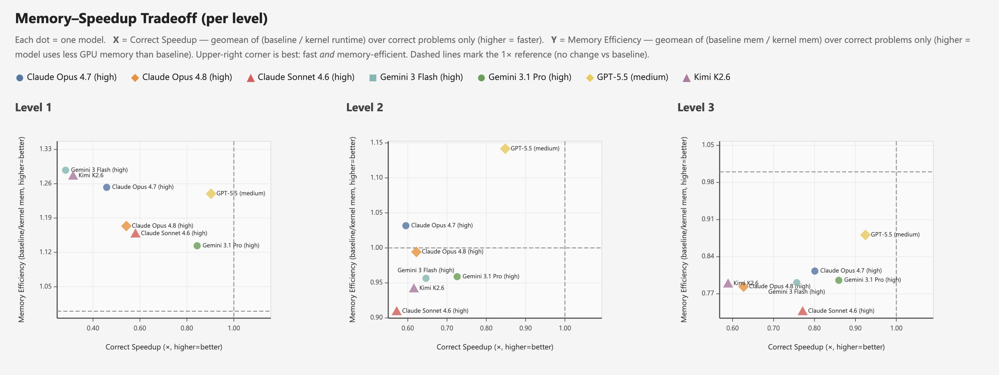

<!--
Copyright (c) Meta Platforms, Inc. and affiliates.
All rights reserved.

This source code is licensed under the license found in the
LICENSE file in the root directory of this source tree.
-->

# KernelBench-Verified: Do LLM-Generated Kernels Actually Beat PyTorch?

## Fork provenance

This repository is maintained at [shadowfall09/KernelBench](https://github.com/shadowfall09/KernelBench).
The current code is based on [Meta KernelBench-Verified](https://github.com/facebookresearch/kernel_bench_verified)
at commit `3fdf6fec7372a4d0cb682635f00e7bdcbc55d50e`, with the batch workflows
migrated from the previous KernelBench fork. The original research attribution
and license are retained below. Earlier fork versions remain in Git history.

## Integrated batch workflows

This checkout also includes the Docker/Slurm, Modal, local verification queue and
baseline-analysis workflows migrated from `KernelBench-modified`. They share
`scripts/run_batch.py`, default to Verified hidden correctness gating and preserve
timing/memory outputs. See [Batch workflows](docs/BATCH_WORKFLOWS.md) for setup,
backend choices, resume behavior and compatibility entrypoints.

```bash
python scripts/run_batch.py --generation docker --evaluation docker \
  --level 1 --start 1 --end 10 --run-name my_run \
  --hardware RTX_A6000 --gpu-arch Ampere --gpus 0 --resume
```

**Extended evaluation framework for LLM-generated GPU kernels with realistic baselines and robust correctness validation.**

Yunxiang Zhang<sup>1</sup>, Ping Yu<sup>2</sup>, Jianyu Wang<sup>1</sup>, Max (Xiangjun) Fan<sup>1</sup>, Julian Reed<sup>3</sup>, Azalia Mirhoseini<sup>3</sup>, Will Su<sup>1</sup>

<sup>1</sup>Meta &nbsp;&nbsp; <sup>2</sup>FAIR at Meta SuperIntelligence Lab &nbsp;&nbsp; <sup>3</sup>Stanford University

[](https://scalingintelligence.stanford.edu/kernelbenchverifiedleaderboard/)
[](KernelBench_Verified_Report.pdf)

---

Recent large language models (LLMs) can generate custom CUDA kernels that appear to outperform PyTorch on benchmarks such as KernelBench. Building upon this foundational framework, we demonstrate that [...]

We introduce **KernelBench-Verified**, an extended evaluation framework that incorporates:
1. **TF32-enabled baseline** - Realistic performance measurement with Tensor Core acceleration
2. **Four-distribution hidden test suite** - Robust correctness validation across varied inputs
3. **Memory efficiency metrics** - Capturing the speed-memory tradeoff in kernel optimization

Under verified evaluation with seven frontier LLMs, GPT-5.5 achieves **0.88×** geometric mean speedup, significantly lower than the 1.43× speedup observed under standard evaluation. No model consist [...]

## Leaderboard



Each dot is one model. **X** = Correct Speedup (geomean of baseline / kernel runtime over correct problems only; higher = faster). **Y** = Memory Efficiency (geomean of baseline mem / kernel mem over correct problems only; higher = uses less GPU memory than baseline). The upper-right corner is best (fast *and* memory-efficient); dashed lines mark the 1× reference (no change vs baseline). See the full interactive [Verified Leaderboard](https://scalingintelligence.stanford.edu/kernelbenchverifiedleaderboard/).

## Framework Components

### TF32 Baseline Configuration

Enable TF32 in PyTorch to match practitioner deployment:

```python
# Enable TF32 acceleration in PyTorch
torch.set_float32_matmul_precision('high')
# Equivalent: torch.backends.cuda.matmul.allow_tf32 = True
```

This routes all float32 matmul and convolution operations through Tensor Cores, providing the realistic baseline against which speedups should be measured.

### Multi-Distribution Hidden Test Suite

Each problem has a hidden test file at `hidden_tests/level{L}/{pid}_hidden.py` defining `get_hidden_inputs()` that returns four distributions. A kernel must pass **all four distributions** to be consi [...]

| Distribution | Transform | Catches |
|--------------|-----------|---------|
| **D1** | Original (×1.0) | Baseline correctness |
| **D2** | Scale ×3.0 | Overflow, precision issues |
| **D3** | Scale ×0.01 | Underflow, epsilon issues |
| **D4** | Negate ×(-1.0) | Sign shortcuts, identity tricks |

### Input-Blind Generation

For 4 problems susceptible to reward hacking, test inputs are automatically stripped from the generation prompt. See [docs/INPUT_BLIND_GENERATION.md](docs/INPUT_BLIND_GENERATION.md) for details.

## Installation

```bash
# Clone the repository
git clone https://github.com/facebookresearch/kernel_bench_verified.git
cd kernel_bench_verified

# Create conda environment
conda create -n kernel-bench python=3.10
conda activate kernel-bench

# Install dependencies
pip install -r requirements.txt

# Set API keys (for OpenAI, Anthropic, etc.)
export OPENAI_API_KEY="your-key-here"
export ANTHROPIC_API_KEY="your-key-here"
# ... other provider keys as needed
```

## Usage

### Full Evaluation Pipeline

```bash
# 1. Generate kernels (5 samples per problem)
python scripts/generate_samples.py \
  run_name=gpt-5.5_level1_test \
  dataset_src=local \
  level=1 \
  num_samples=5 \
  server_type=openai \
  model_name=gpt-5.5 \
  max_tokens=32000 \
  temperature=0.8 \
  num_workers=4

# 2. Standard evaluation (correctness + timing + memory)
python scripts/eval_from_generations.py \
  run_name=gpt-5.5_level1_test \
  dataset_src=local \
  level=1 \
  num_samples=5 \
  eval_mode=local \
  gpu_arch="['Hopper']" \
  num_gpu_devices=8 \
  timeout=600 \
  build_cache=True \
  num_cpu_workers=1 \
  precision=fp32 \
  measure_performance=True

# 3. Hidden evaluation (4-distribution correctness gating)
python scripts/eval_from_generations.py \
  run_name=gpt-5.5_level1_test \
  dataset_src=local \
  level=1 \
  num_samples=5 \
  eval_mode=local \
  gpu_arch="['Hopper']" \
  num_gpu_devices=8 \
  timeout=600 \
  build_cache=True \
  num_cpu_workers=1 \
  precision=fp32 \
  use_hidden_tests=True \
  measure_performance=False

# 4. Generate leaderboard with verified metrics
python scripts/generate_leaderboard.py \
  --use_hidden_eval \
  --baseline baseline_time_torch_tf32 \
  --fp32_tolerance 1e-3 \
  --out leaderboard.html
```

### Key Flags

- `--use_hidden_tests`: Enable 4-distribution hidden correctness testing (outputs `eval_results_hidden.json`)
- `--use_hidden_eval`: Apply hidden eval gating in leaderboard (only kernels passing all 4 distributions count as correct)
- `--baseline baseline_time_torch_tf32`: Use TF32-enabled PyTorch baseline (realistic performance)
- `--fp32_tolerance 1e-3`: FP32 numerical tolerance for correctness checking

### Generate Hidden Tests

```bash
# Regenerate hidden tests for all Level 1 problems
python scripts/generate_hidden_inputs.py --level 1

# Regenerate for a single problem
python scripts/generate_hidden_inputs.py --level 1 --pid 90
```

### Adding New Problems to Input-Blind List

1. Add `(level, pid)` to `STRIP_TEST_CONFIG_PIDS` in `src/prompt_constructor.py`
2. Add shape annotations to the problem's `forward()` docstring in `KernelBench/level{L}/{problem}.py`
3. Regenerate stripped prompts and re-evaluate

## Output Files

- `runs/{run_name}/eval_results.json` — Standard evaluation (correctness, runtime, memory)
- `runs/{run_name}/eval_results_hidden.json` — Hidden evaluation (4-distribution gated correctness)
- `leaderboard.html` — Interactive HTML leaderboard with verified metrics

## Citation

If you use KernelBench-Verified in your research, please cite:

```bibtex
@article{zhang2026kernelbenchverified,
  title={KernelBench-Verified: Do LLM-Generated Kernels Actually Beat PyTorch?},
  author={Zhang, Yunxiang and Yu, Ping and Wang, Jianyu and Fan, Max (Xiangjun) and Reed, Julian and Mirhoseini, Azalia and Su, Will},
  journal={arXiv preprint},
  year={2026}
}
```

## License

This source code is licensed under the MIT License. See the LICENSE file for details.

Copyright (c) Meta Platforms, Inc. and affiliates. All rights reserved.

## Acknowledgments

KernelBench-Verified builds upon the original [KernelBench](https://github.com/ScalingIntelligence/KernelBench) benchmark. We thank the KernelBench authors for their foundational work.
